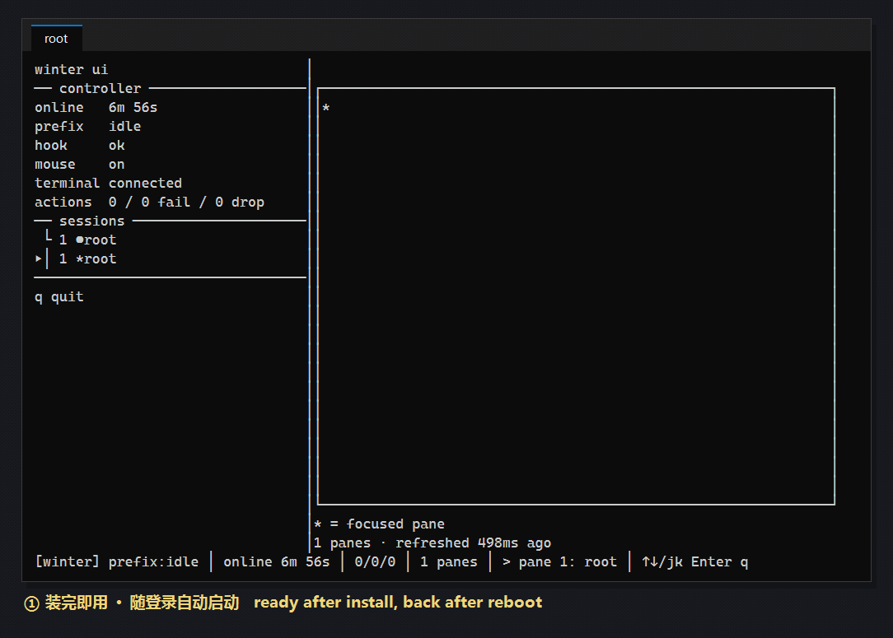

# Winter

**给 Windows Terminal 加上 tmux 式前缀键控制 —— 不替换它。**

Winter 在你正在使用的 Windows Terminal 上增加 tmux 式的两段式 Prefix（先按 `Ctrl+B`，
再按第二个键）。它不绘制窗口、不内嵌终端、也不管理 PTY：Windows Terminal 依然是唯一的
界面、渲染器、窗格树、标签页和 Shell 所有者，你的 Profile、主题、字体、Shell 与已有
快捷键都不受影响。



## 安装

```powershell
git clone https://github.com/raincfhnj/winter.git
cd winter
.\install.ps1
```

`install.ps1` 只需执行一次：它构建 Release 二进制、把 `winter` 放进 `PATH`、安装
Windows Terminal 集成，并注册一个当前用户的登录任务。整个过程中只有注册该任务需要
一次管理员授权。

装完之后，Prefix 在每个会话里都能用，关机重启后也会自动恢复——不需要再手动运行任何
东西。查看或调整：

```powershell
winter autostart status     # 只读报告，不弹 UAC
winter autostart enable     # 移动了二进制位置后重新注册
winter autostart disable    # 取消登录自启
```

## 按键绑定

所有快捷键仅在 Windows Terminal 位于前台时生效：先按下并释放 `Ctrl+B`，再按第二个键。

| 第二键 | 功能 |
|---|---|
| `←` / `→` / `↑` / `↓` | 聚焦对应方向的窗格 |
| `Shift` + 方向键 | 向对应方向分屏 |
| `Ctrl` + 方向键 | 调整活动窗格尺寸 |
| `C` | 新建标签页 |
| `N` / `P` | 下一个 / 上一个标签页 |
| `0`–`9` | 激活零基索引标签页 |
| `X` | 关闭活动窗格 |
| `Z` | 放大 / 恢复活动窗格 |
| `,` | 重命名当前标签页 |
| `B` | 向 Shell 发送原始 Prefix（即 `Ctrl+B`） |
| `Q` | 退出控制器（不关闭 Windows Terminal） |
| `Escape` | 取消 Prefix |

Prefix 默认 1500 ms 后超时，任何未绑定的第二键都会取消它。把鼠标移到原生分隔线上按住
左键拖动即可调整窗格比例，尺寸按 Terminal 原生约 5% 的步长变化。

## 使用方法

| 命令 | 作用 |
|---|---|
| `winter` | 启动控制器并打开 Windows Terminal |
| `winter ui` | 在本窗格显示实时会话管理器：控制器状态、标签页、窗格 |
| `winter config` | 输出生效配置（`--path`、`--edit`） |
| `winter plan` / `install` / `uninstall` | 预览 / 安装 / 移除集成 |
| `winter doctor` | 机器可读的健康报告（JSON） |
| `winter autostart status\|enable\|disable` | 管理登录自启任务 |

配置文件位于 `%LOCALAPPDATA%\Winter\config.toml`，只写想覆盖的动作即可；修改快捷键
无需重新执行 `winter install`。

```toml
prefix = "ctrl+a"

[shortcuts]
focus_left = "h"
focus_down = "j"
focus_up = "k"
focus_right = "l"
new_tab = "t"
shutdown = "q"
```

## 卸载

```powershell
winter uninstall
```

会移除登录任务、action fragment、隐藏键位与 Shell 受管块——只删除仍属于 Winter 的部分，
你自己改过的内容会被保留并报告。

## 许可证

采用以下任一许可证：[Apache License, Version 2.0](LICENSE-APACHE) 或
[MIT license](LICENSE-MIT)。
